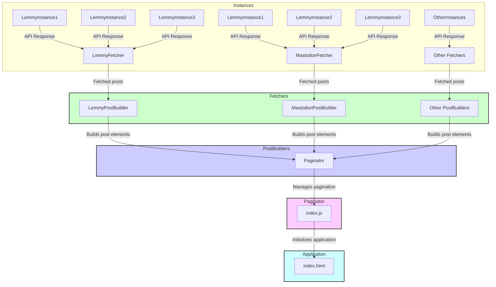
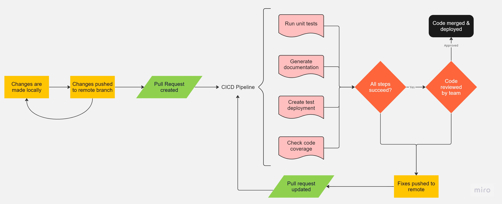

# Fediverse Feed Amalgamator

This repository is a Feed Amalgamator for various Fediverse platforms, in order to have a shared trending feed across all of them. This project was completed by 'Works on my Machine', Team 3 of CSE 210 at UC San Diego in Fall of 2023. The website is hosted here: https://fediblend.netlify.app/

## Team Members
- Eric Zhang
- Jackson Conte
- Josh Cross
- Kaize Yao
- Lakshya Lnu
- Om Prakaash Pandiyaraju
- Shrivaths Shyam
- Siddharth
- Varun Singh

# Project Architecture

# Repository Structure
The project's source code is organized into the following directories and files within the `src` folder:

- `scripts/`: Contains the core JavaScript logic of the application.
  - `entity/`: Defines the data models and constants.
    - `Constant.js`: Stores constants used throughout the application.
    - `Post.js`: Represents a custom HTML element for a post.
  - `fetchers/`: Contains classes responsible for fetching data from different Fediverse platforms.
    - `Fetcher.js`: An abstract base class for all fetchers.
    - `LemmyFetcher.js`: Fetches posts from Lemmy instances.
    - `MastodonFetcher.js`: Fetches posts from Mastodon instances.
  - `index.js`: The main JavaScript file that initializes the application and handles user interactions.
  - `paginator.js`: Manages the pagination of posts within the feed.
  - `postBuilder/`: Contains classes that construct post elements from raw data.
    - `LemmyPostBuilder.js`: Builds post elements for Lemmy posts.
    - `MastodonPostBuilder.js`: Builds post elements for Mastodon posts.
    - `PostBuilder.js`: An abstract base class for all post builders.
  - `PostFactory.js`: A factory class for creating the appropriate fetcher and post builder based on the platform instance.
- `styles/`: Contains CSS files for styling the application.
  - `index.css`: The main stylesheet that defines the look and feel of the application.

# Application Workflow

1. **Initialization**: The `index.js` file is the entry point of the application. It initializes the application by fetching posts from various instances and creating post elements.

2. **Fetching Posts**: The `PostFactory` is used to create instances of `Fetcher` and `PostBuilder` for each Fediverse platform. The `Fetcher` classes (`LemmyFetcher`, `MastodonFetcher`, etc.) are responsible for making API calls to their respective platforms and retrieving the raw post data.

3. **Building Posts**: The raw post data is then passed to the corresponding `PostBuilder` classes (`LemmyPostBuilder`, `MastodonPostBuilder`, etc.), which create custom `fedi-post` elements that represent the posts in the DOM.

4. **Pagination**: The `Paginator` class manages the display of posts in a paginated format, allowing users to navigate through the feed using "Next" and "Previous" buttons.

5. **Styling**: The `index.css` file provides the styles for the application, ensuring a consistent and user-friendly interface.

# Running this Server

This platform is hosted and available at https://fediblend.netlify.app/. If you want to host it yourself, you'll need NodeJS >= 14.0. Then, simply follow these instructions:

1. Clone or download the repository
2. With a terminal in the repo's directory, run `npm install` to download dependencies
3. Run `npm run` to start the server

# CICD Pipeline

Our code follows the pipeline below before it hits production environments.

Our CICD pipeline specifically has the following checks:
- All unit tests are ran and must pass
- Documentation must successfully generate without errors.
- A deployment to a test environment must succeed.
- Code coverage is checked (but not currently enforced).

Pushing to main is blocked unless all of the above steps pass and the code is approved by a different team member.

# Additional Documentation

- [Testing](admin/Testing.md)
- [Trending Specification](specs/Trending%20posts%20specification.md)
